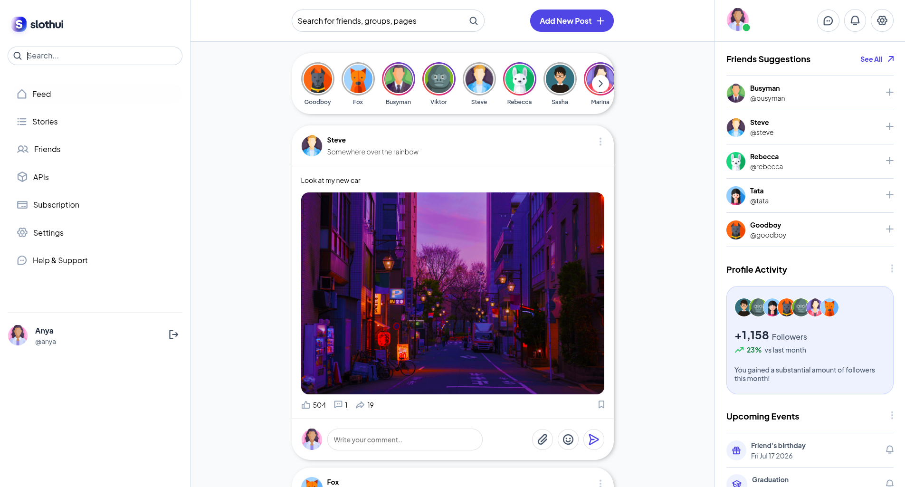
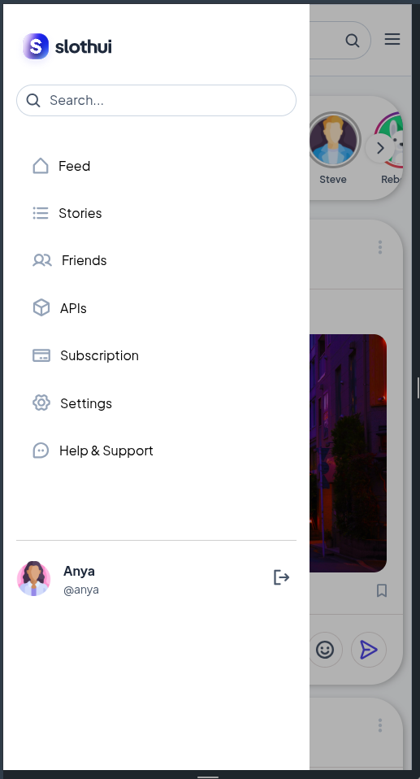

# SlothUI — Social Media Frontend App

**SlothUI** is a minimalist, Instagram-inspired social media interface built with React and TypeScript. It features a clean, interactive UI that includes posts, stories, likes, comments, and simple navigation — all handled purely on the frontend.

## Features

- Simple login (no backend)
- Home feed with posts
- Stories section with modal view
- Comment system per post
- Like system with counter
- Sidebar navigation (Feed, Friends, APIs, etc.)
- Clean and responsive design

> All data is stored in component state (no backend, no database).

## Tech Stack

- **Framework:** React (with Vite)
- **Language:** TypeScript
- **State Management:** useState, useEffect
- **Styling:** CSS Modules
- **Assets:** SVG icons and local avatars

## Project Structure

```
src/
├── assets/         # Avatars, icons, post images
├── components/     # Reusable UI components (Navbar, Post, Story, etc.)
├── pages/          # Main views (Home, Auth)
├── models/         # TypeScript types and classes
├── App.tsx         # Main app wrapper
└── main.tsx        # React entry point
```

## 📷 Screenshots





## Installation

```bash
git clone https://github.com/xassdly/slothui.git
cd slothui
npm install
npm run dev
```

## Motivation

This project was built as a personal frontend challenge to improve React and UI skills. It focuses on:
- Component-based architecture
- Clean logic separation
- Practicing state management without relying on external APIs

## UI Design Credit

The UI design for this project is based on a concept by **SlothUI**, originally found on Figma.

*Note: This project is a frontend implementation and not affiliated with the original designer.*
